# ?? How the Dead Internet Secretly Influences You

> **Cha?ne** : [Soon](https://www.youtube.com/@soontechnology)  
> **Lien YouTube** : [https://www.youtube.com/watch?v=5LZ1TaFmDZA](https://www.youtube.com/watch?v=5LZ1TaFmDZA)  
> **Date de publication** : 20261003  
> **Dur?e** : 00:20:50  
> **Identifiant vid?o** : `5LZ1TaFmDZA`  
> **Transcription & Analyse** : `gemini-3.8-flash+gemini-3.5-flash-lite`  

---

## ?? Synth?se Ex?cutive & Outils

### ?? R?sum?
Dans ce reportage immersif intitul? **Comment l'Internet mort vous influence à votre insu**, la cha?ne Soon explore en d?tail les coulisses techniques et soci?tales des nouvelles technologies.

### ??? Outils, Mod?les & Logiciels Pr?sent?s
- **Technologies IA et Automatisation** : D?ploiement d'agents et scripts connect?s.

### ?? Points Cl?s & Enseignements Strat?giques
- Comprendre les architectures distribu?es et leur impact sur le web moderne.
- Mesurer les implications ?thiques et ?conomiques des technologies autonomes.

---

## ?? Chronologie & Transcription Compl?te Audio & Visuelle (Mot pour Mot)

### ?? `[00:00:00 - 00:00:20]` | Segment #01

**?? Audio (Transcription Int?grale Mot pour Mot en Fran?ais) :**
> J'ai l'impression de devenir fou. J'étais perdu dans la spirale de TikTok quand je suis tombé sur cette vidéo : « Je viens d'être recalé chez Walmart comme caissier. J'ai une licence. » Et puis cette vidéo : « J'ai été recalé chez Walmart comme caissier. J'ai fait quatre ans d'études. » Et puis cette vidéo : « Je viens d'être recalé chez Walmart comme caissier. J'ai un diplôme. »

**??? Analyse Visuelle d'?cran (gemini-3.5-flash-lite) :**
**Interface & Outils** : TikTok

**Contenu textuel & Donn?es** : "i got rejected from a minimum wage job. it's always matters more there" et "i just got rejected"

**Action / D?monstration** : Visionnage de vidéos sur TikTok.

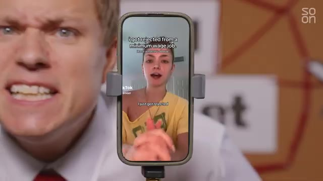
*?? 00:00:05 ? Un homme regarde un téléphone portable, l'air angoissé. L'écran du téléphone affiche une vidéo TikTok.*

---

### ?? `[00:00:20 - 00:00:40]` | Segment #02

**?? Audio (Transcription Int?grale Mot pour Mot en Fran?ais) :**
> C'est quoi ce délire ? Comment se fait-il que tous ces jeunes instruits ne puissent pas obtenir un emploi de bas niveau chez Walmart ? Il s'avère que ce sont toutes des publicités. Internet est devenu une gigantesque opération d'influence, et avec l'arrivée de bots propulsés par l'IA, nous fonçons désormais à toute allure vers un monde où la théorie du complot de l'Internet mort pourrait bien être réelle.

**??? Analyse Visuelle d'?cran (gemini-3.5-flash-lite) :**
**Interface & Outils** : Plateformes de réseaux sociaux et interfaces web (commentaires et fils de discussion).

**Contenu textuel & Donn?es** : Commentaires d'utilisateurs sur Internet évoquant les publicités non déclarées et des discussions sur les réseaux sociaux.

**Action / D?monstration** : Navigation et affichage de réactions d'utilisateurs illustrant le débat sur la publicité cachée en ligne.

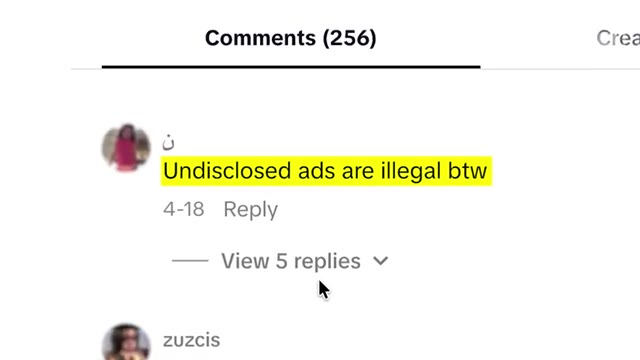
*?? 00:00:25 ? Capture d'écran montrant un commentaire sur une plateforme en ligne, avec le texte surligné en jaune : "Undisclosed ads are illegal btw".*

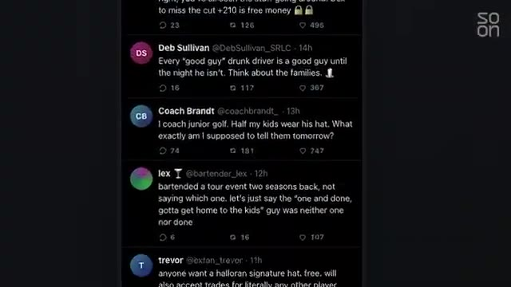
*?? 00:00:30 ? Capture d'écran affichant une liste de publications et de tweets de différents utilisateurs avec leurs pseudonymes et des compteurs d'interactions.*

---

### ?? `[00:00:40 - 00:01:04]` | Segment #03

**?? Audio (Transcription Int?grale Mot pour Mot en Fran?ais) :**
> Mais comment tout cela fonctionne-t-il ? Alors, pour commencer, je vais vous expliquer la théorie de l'Internet mort. Ensuite, nous découvrirons les tactiques utilisées par les spécialistes du marketing pour vous vendre des choses. « Nous essayons d'influencer la culture, nous essayons sans aucun doute d'influencer l'opinion. » Ensuite, nous verrons comment des campagnes de bots alimentées par l'IA peuvent bâtir et détruire des réputations. « Je pense que la vérification des faits est dépassée, c'est certain. Nous ne disons pas que c'est vrai, que c'est faux. » Et enfin, je vous montrerai comment ces mêmes tactiques d'IA sont utilisées par des États-nations pour influencer la géopolitique.

**??? Analyse Visuelle d'?cran (gemini-3.5-flash-lite) :**
**Interface & Outils** : Interface graphique de visualisation de réseau ("The Network" / "Op Console") avec des nœuds connectés.

**Contenu textuel & Donn?es** : Schéma de réseau de données interconnectées avec des points lumineux rouges et blancs sur fond noir, et texte explicatif des sections du reportage.

**Action / D?monstration** : Navigation et présentation visuelle des thématiques du reportage (Internet mort, tactiques marketing et de réputation).

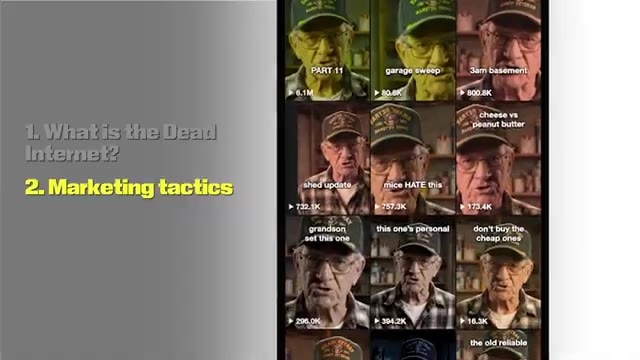
*?? 00:00:46 ? Capture montrant une grille de vidéos avec un homme âgé portant une casquette et des lunettes, illustrant les sujets abordés à gauche (théorie de l'Internet mort et tactiques marketing).*

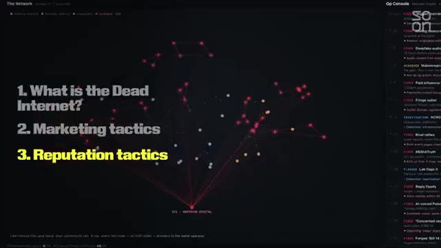
*?? 00:00:52 ? Interface numérique sombre affichant un réseau de points connectés en rouge et un panneau de console à droite, avec le plan des sujets incluant les tactiques de réputation en surbrillance.*

---

### ?? `[00:01:04 - 00:01:24]` | Segment #04

**?? Audio (Transcription Int?grale Mot pour Mot en Fran?ais) :**
> Les techniques de marketing en ligne, c'est la même chose que les opérations d'influence. Mais d'abord, qu'est-ce que l'Internet mort ? Pour résumer cette théorie, même si Internet a l'air d'être un endroit plein de vie, une grande partie du contenu en ligne est aujourd'hui fausse. Soit des bots qui publient automatiquement, soit des influenceurs humains rémunérés qui présentent des produits ou des idées sans divulguer leur rémunération.

**??? Analyse Visuelle d'?cran (gemini-3.5-flash-lite) :**
**Interface & Outils** : Forum web / Imageboard thématisé

**Contenu textuel & Donn?es** : Texte de la théorie de l'Internet mort sur un forum (TLDR expliquant que le contenu est généré par l'IA et des influenceurs).

**Action / D?monstration** : Affichage à l'écran du texte fondateur de la théorie de l'Internet mort.

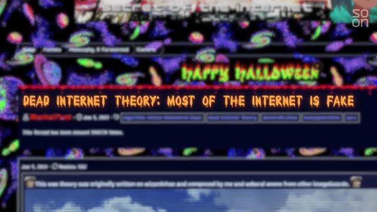
*?? 00:01:14 ? Capture d'écran d'un forum thématique avec le titre 'DEAD INTERNET THEORY: MOST OF THE INTERNET IS FAKE' sur fond coloré.*

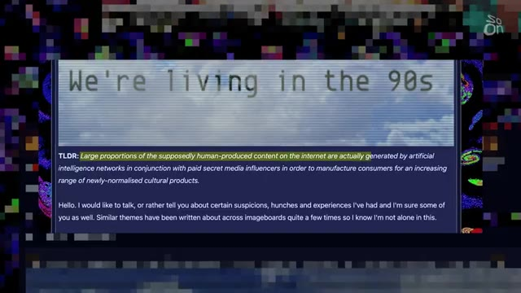
*?? 00:01:19 ? Capture d'écran du message explicatif TLDR détaillant la théorie du Dead Internet concernant le contenu généré par IA.*

---

### ?? `[00:01:24 - 00:01:47]` | Segment #05

**?? Audio (Transcription Int?grale Mot pour Mot en Fran?ais) :**
> Et même si le contenu n'est pas ce que l'on appelle « organique », il est suffisamment bien déguisé pour que les gens continuent d'interagir avec. C'est l'histoire d'une perte d'innocence pour la plus grande merveille que les humains aient jamais construite : Internet. Et cela prend une tournure « galaxy brain » : en tant qu'utilisateurs d'Internet, nous ne contrôlons pas réellement nos fils d'actualité. Nous sommes manipulés. Voici les tactiques dans le style du « Dead Internet » que les spécialistes du marketing utilisent pour vous vendre des choses.

**??? Analyse Visuelle d'?cran (gemini-3.5-flash-lite) :**
**Interface & Outils** : Interface de forum / navigateur web affichant un long message textuel.

**Contenu textuel & Donn?es** : Texte détaillé sur l'historique de plateformes internet, mentionnant 4chan, des références culturelles web et des réflexions personnelles.

**Action / D?monstration** : Affichage d'un texte textuel d'enquête ou de témoignage illustrant le propos sur l'évolution d'Internet.

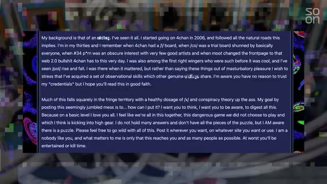
*?? 00:01:30 ? Capture d'écran montrant un long texte en anglais sur fond bleu foncé, évoquant l'historique de 4chan et des théories Internet.*

---

### ?? `[00:01:47 - 00:02:12]` | Segment #06

**?? Audio (Transcription Int?grale Mot pour Mot en Fran?ais) :**
> Et il ne s'agit pas seulement de bots, comme on pourrait le penser, ce sont aussi de vraies personnes. Et cette pratique consistant à utiliser des complices infiltrés pour vendre des produits en ligne remonte à bien avant que les réseaux sociaux ne deviennent le mastodonte lucratif qu'ils sont aujourd'hui. Prenez ce documentaire de 2001 de l'émission Frontline de PBS, qui dresse le portrait de l'agence de guérilla marketing Cornerstone. Leur spécialité est le marketing sous les radars. Par exemple, Cornerstone embauche des jeunes pour qu'ils se connectent à des salons de discussion et se fassent passer pour de simples fans de l'un de leurs clients.

**??? Analyse Visuelle d'?cran (gemini-3.5-flash-lite) :**
**Interface & Outils** : Ancien système informatique Apple (iMac G3 vintage) avec interface d'époque.

**Contenu textuel & Donn?es** : Écran d'ordinateur ancien affichant une application ou un navigateur textuel des années 2000, et incrustation du logo "PBS Frontline".

**Action / D?monstration** : Le jeune homme tape sur le clavier d'un ordinateur ancien dans une salle informatique.

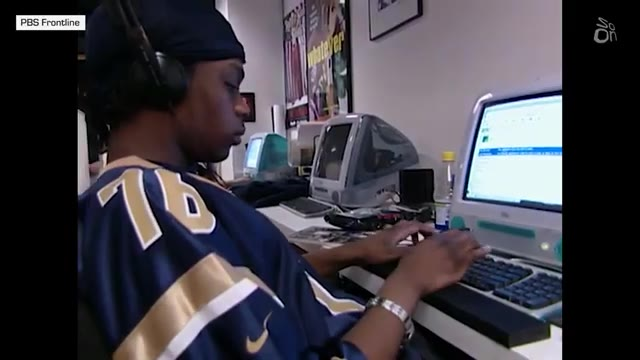
*?? 00:02:06 ? Un jeune homme portant un casque audio et un maillot de sport, assis devant un vieil ordinateur Apple transparent et tapant sur le clavier.*

---

### ?? `[00:02:12 - 00:02:30]` | Segment #07

**?? Audio (Transcription Int?grale Mot pour Mot en Fran?ais) :**
> Même dès ses débuts, Internet a été un endroit pour gagner de l'argent. Mais plutôt que dans les salons de discussion d'hier, la bataille pour influencer votre portefeuille se joue désormais sur votre page « Pour toi ». D'accord, alors la page « Pour toi », à quel point est-ce important ? Je dirais qu'il suffit de jeter un coup d'œil autour de soi à New York. Vous verrez les files d'attente pour les yaourts glacés, vous verrez les files d'attente pour les slop bowls, vous verrez tout un tas de files d'attente partout.

**??? Analyse Visuelle d'?cran (gemini-3.5-flash-lite) :**
**Interface & Outils** : Salon de discussion d'ordinateur.

**Contenu textuel & Donn?es** : Conversation textuelle entre plusieurs utilisateurs.

**Action / D?monstration** : Aucune action visible.

*?? 00:02:16 ? Un écran d'ordinateur affichant une conversation dans un salon de discussion, avec des utilisateurs tels que "Squirrelgirl", "Chousuke" et "Azhi_Dahaka".*

---

### ?? `[00:02:30 - 00:02:49]` | Segment #08

**?? Audio (Transcription Int?grale Mot pour Mot en Fran?ais) :**
> En réalité, personne ne découvre simplement ces endroits en se disant : « Vous savez, c'est le meilleur yaourt glacé, je dois commencer à manger du yaourt glacé et je dois commencer à faire la queue pendant 30 minutes ». Tout cela est influencé par une page « Pour toi ». C'est Zuhair Lakhani. Il travaille dans le marketing sur les réseaux sociaux lié à l'IA. Nous reviendrons à lui dans une minute. Le marketing d'influence sur les réseaux sociaux n'est pas nouveau. Et bien sûr, il y a la catégorie d'influenceurs du niveau des Kardashian et d'Ariana Grande.

**??? Analyse Visuelle d'?cran (gemini-3.5-flash-lite) :**
**Interface & Outils** : Aucun logiciel ou interface numérique affiché.

**Contenu textuel & Donn?es** : Panneau en arrière-plan avec les mots « Dead » et « Inter... » ainsi que des logos de réseaux sociaux.

**Action / D?monstration** : Le présentateur s'adresse directement à la caméra en parlant.

---

### ?? `[00:02:49 - 00:03:08]` | Segment #09

**?? Audio (Transcription Int?grale Mot pour Mot en Fran?ais) :**
> Il est assez évident que s'ils utilisent un produit et l'identifient, il s'agit très probablement d'un partenariat rémunéré. Mais il existe tout un genre de marketing qui fusionne l'esthétique de jeunes gens à l'apparence ordinaire créant du contenu apparemment générique, partageant des astuces, des tendances et des mèmes, qui ne sont en réalité que des publicités pour des produits. C'est une industrie massive et organisée connue sous le nom d'UGC, le contenu généré par les utilisateurs.

**??? Analyse Visuelle d'?cran (gemini-3.5-flash-lite) :**
**Interface & Outils** : Application mobile TikTok (interface avec flux vidéo, commentaires, boutons de partage et de like).

**Contenu textuel & Donn?es** : Texte incrusté sur la vidéo ("How I feel knowing I'll never get falsely accused of AI ever again with GPTZero"), hashtags (#gptzeroad, #college, #school, #student) et section de commentaires.

**Action / D?monstration** : Navigation et affichage d'une publication vidéo sur les réseaux sociaux promouvant un outil (GPTZero).

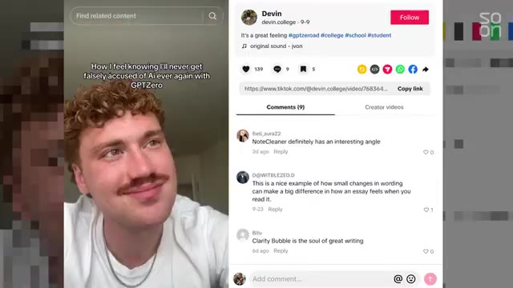
*?? 00:03:03 ? Capture d'une interface de réseau social (TikTok) montrant un créateur de contenu avec du texte et des commentaires.*

---

### ?? `[00:03:08 - 00:03:31]` | Segment #10

**?? Audio (Transcription Int?grale Mot pour Mot en Fran?ais) :**
> Et comme je vais vous le montrer bientôt, cela s'accélère avec l'IA. Pour beaucoup de jeunes, cela peut être une activité secondaire super lucrative, mais cela rend difficile de distinguer ce qui est réel de ce qui est une publicité sponsorisée sur Internet. Cela me ramène à ces TikToks qui m'ont fait péter un câble au début de la vidéo. Même s'ils avaient tous le même script, chacun d'eux vendait un produit différent : « Si je ne créais pas et ne vendais pas de business d'IA sur CTR.new, je serais en train de crouler sous tellement de dettes en ce moment. »

**??? Analyse Visuelle d'?cran (gemini-3.5-flash-lite) :**
**Interface & Outils** : Application mobile TikTok affichée sur un écran de smartphone.

**Contenu textuel & Donn?es** : Vidéo TikTok avec un créateur de contenu et du texte sous-titré ("as a cashier").

**Action / D?monstration** : Présentation visuelle d'un exemple de contenu TikTok pendant le commentaire audio.

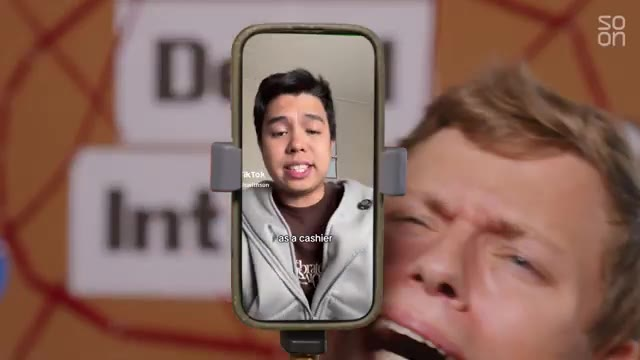
*?? 00:03:19 ? Gros plan sur un smartphone montrant une vidéo TikTok, illustrant le sujet des publicités et contenus générés en ligne.*

---

### ?? `[00:03:31 - 00:03:54]` | Segment #11

**?? Audio (Transcription Int?grale Mot pour Mot en Fran?ais) :**
> Si je n'avais pas Dealism, cet agent de vente IA, je serais probablement là dehors en train de lutter pour survivre. Si je ne faisais pas des trucs avec des marques sur SideShift, je vivrais dans un fossé. J'ai pu entrer en contact avec Emmy, qui a réalisé l'une de ces vidéos ayant fait plus de 16 millions de vues sur TikTok. Elle a 21 ans, possède huit comptes distincts, chacun poussant du contenu pour différentes marques, et s'attend à gagner largement plus de six chiffres l'année prochaine, rien qu'avec l'UGC.

**??? Analyse Visuelle d'?cran (gemini-3.5-flash-lite) :**
**Interface & Outils** : Navigateur web affichant la plateforme TikTok.

**Contenu textuel & Donn?es** : Profil TikTok d'Emi Renee avec des statistiques d'abonnés et une grille de vidéos.

**Action / D?monstration** : Navigation et présentation du profil TikTok d'un créateur de contenu.

*?? 00:03:48 ? Capture d'écran du profil TikTok de "emi renee" avec ses différentes vidéos en grille.*

---

### ?? `[00:03:54 - 00:04:13]` | Segment #12

**?? Audio (Transcription Int?grale Mot pour Mot en Fran?ais) :**
> Dites-moi ce qu'est l'UGC et ce que vous faites. Le but est de ne pas avoir l'air d'un professionnel. Je ne me maquille pas vraiment dans mes vidéos, et c'est fait exprès. Ce n'est pas un cadre super professionnel, et c'est fait exprès. Est-ce votre travail à plein temps de gérer ces différents comptes ? Pour générer des revenus en ce moment, c'est juste l'UGC. En réalité, je suis actrice.

**??? Analyse Visuelle d'?cran (gemini-3.5-flash-lite) :**
**Interface & Outils** : none

**Contenu textuel & Donn?es** : logo "soon"

**Action / D?monstration** : none

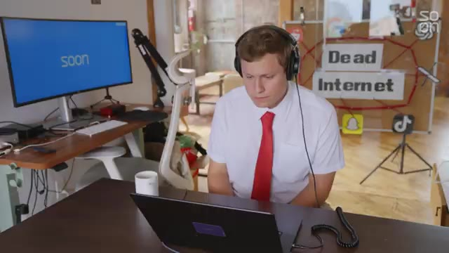
*?? 00:03:59 ? Un homme porte un casque et regarde un écran d'ordinateur qui affiche le logo "soon".*

---

### ?? `[00:04:13 - 00:04:36]` | Segment #13

**?? Audio (Transcription Int?grale Mot pour Mot en Fran?ais) :**
> C'est ce que je fais la majeure partie du temps, et pour l'UGC, je me réserve généralement une à trois heures par jour. Une à trois heures par jour ? Combien de vidéos pourrais-tu faire en une à trois heures ? Ces vidéos face caméra ? Je veux dire, six et demie par heure, c'est sûr. De la même manière que le marketing de guérilla dans les salons de discussion peut nous sembler désuet aujourd'hui, le contenu UGC humain d'Emmy pourrait sembler dépassé dans quelques années, alors que le contenu généré par l'IA entre sur le ring.

**??? Analyse Visuelle d'?cran (gemini-3.5-flash-lite) :**
**Interface & Outils** : Aucun logiciel ou interface n'est affiché.

**Contenu textuel & Donn?es** : Aucun contenu textuel ou graphique pertinent.

**Action / D?monstration** : Les personnes s'adressent directement à la caméra en parlant.

---

### ?? `[00:04:36 - 00:04:54]` | Segment #14

**?? Audio (Transcription Int?grale Mot pour Mot en Fran?ais) :**
> Revenons à ce gars, Zuhair. C'est le fondateur de 22 ans de DoubleSpeed, une ferme à bots financée par du capital-risque. Leur slogan est « the Dead Internet Company ». Bienvenue dans l'Internet mort. Quand je pense à une ferme à bots, je pense à une bande de bots qui likent et commentent avec des phrases simples sur du contenu ciblé. Mais DoubleSpeed a créé toute une armée de créateurs d'UGC générés par l'IA.

**??? Analyse Visuelle d'?cran (gemini-3.5-flash-lite) :**
**Interface & Outils** : Interface logicielle de gestion de bots et de vidéos.

**Contenu textuel & Donn?es** : Vues de profils TikTok automatisés, champs de légende et boutons de publication ("Queue").

**Action / D?monstration** : Visualisation et gestion d'une ferme de bots et de publications automatisées.

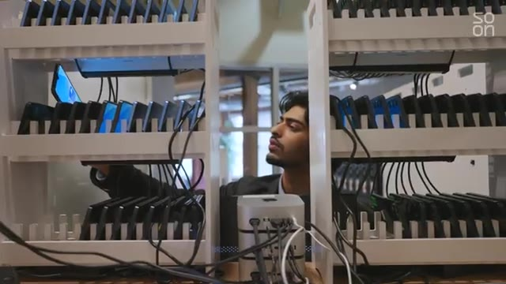
*?? 00:04:40 ? Un jeune homme inspecte une installation de serveurs et de smartphones connectés en rack.*

*?? 00:04:45 ? Une vue large d'une immense ferme de téléphones portables alignés sur des étagères métalliques.*

*?? 00:04:49 ? Une interface logicielle montrant plusieurs flux vidéo automatisés de comptes de réseaux sociaux.*

---

### ?? `[00:04:54 - 00:05:26]` | Segment #15

**?? Audio (Transcription Int?grale Mot pour Mot en Fran?ais) :**
> Est-ce que le persona synthétique fonctionne aussi bien qu'une personne payée pour faire de l'UGC ? Alors, vous savez, ça dépend vraiment du type de contenu que vous voulez publier. Mais par exemple, des vidéos de démonstration avec une accroche, n'est-ce pas, où c'est juste une expression. Du genre : « C'est pas possible, je viens de découvrir ça ». Et ensuite, c'est comme une capture d'écran vidéo d'une application. Vous savez, ce genre de choses, vous devriez probablement les faire avec l'IA à ce stade. C'est beaucoup plus efficace. Et le vrai problème pour moi, c'est que, vous savez, quand je faisais ça avec de vrais créateurs humains, c'était tellement pénible parce que ces étudiants ne veulent pas être sur Slack, ils ne veulent pas être sur Discord, ils ne veulent pas répondre, ils veulent être sur iMessage, peu importe, et puis, vous savez, s'ils ont des devoirs un jour, ils ne vont tout simplement pas publier, ou ils ne feront tout simplement pas de vidéo, même si vous les payez.

**??? Analyse Visuelle d'?cran (gemini-3.5-flash-lite) :**
**Interface & Outils** : Aucun (discussion en rue)

**Contenu textuel & Donn?es** : Aucun texte ou graphique affiché

**Action / D?monstration** : Discussion et interview en extérieur

---

### ?? `[00:05:26 - 00:06:00]` | Segment #16

**?? Audio (Transcription Int?grale Mot pour Mot en Fran?ais) :**
> Donc c'est vraiment, genre, pour moi, c'était comme s'éloigner de ça et faire ça avec l'IA. Zuhair me montre certains de ses posts générés par IA qui ont étonnamment bien marché. Et cette personne a un demi-million de likes. Ouais. D'abonnés. Il y a 50 comptes exactement comme ça. Tu peux gérer l'un de ces comptes dès maintenant si tu veux, sous ton propre nom, et ils peuvent promouvoir tout ce que tu veux. Et à quelle fréquence publie celui-ci ? Deux fois par jour. Je veux voir par moi-même à quel point il est facile de faire quelque chose comme ça avec des outils de base. En utilisant un abonnement à 20 dollars à Gemini de Google, je lui ai demandé de me créer une fausse vidéo UGC pour les réseaux sociaux pour une entreprise d'un milliard de dollars appelée « A Better Mousetrap ». Sérieusement, le

**??? Analyse Visuelle d'?cran (gemini-3.5-flash-lite) :**
**Interface & Outils** : Interface web de tarification Google AI.

**Contenu textuel & Donn?es** : Offres d'abonnement Google AI Plus ($4.99/mois), Pro ($19.99/mois) et Ultra ($99.99/mois) avec descriptions des fonctionnalités.

**Action / D?monstration** : Affichage des différentes options de plans tarifaires d'IA.

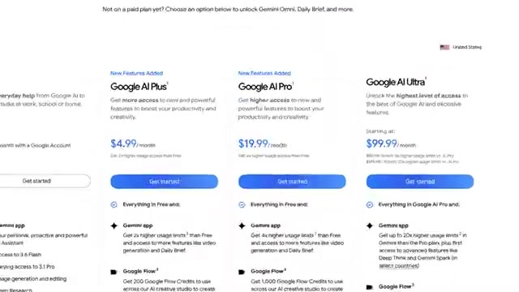
*?? 00:05:52 ? Capture d'écran montrant une page web de tarification de services d'intelligence artificielle (Google AI Plus, Pro, Ultra).*

---

### ?? `[00:06:00 - 00:06:19]` | Segment #17

**?? Audio (Transcription Int?grale Mot pour Mot en Fran?ais) :**
> Le marché potentiel total pour les pièges à souris est énorme et ces pièges sont de première qualité, d'accord ? Fabriqués en Amérique. Nous ne fabriquons que le meilleur piège à souris. Je donne quelques instructions de base à Gemini. Il a une barbe, un script ridicule et dit : « Je déteste les souris ». Quelques minutes plus tard, j'obtiens cette pépite. « Je déteste les souris. Mais ici, dans le Midwest, nous savons comment nous en débarrasser, sans poser de questions. »

**??? Analyse Visuelle d'?cran (gemini-3.5-flash-lite) :**
**Interface & Outils** : Interface de type IA/chatbot (style Gemini ou similaire) avec champ de saisie de prompt.

**Contenu textuel & Donn?es** : Texte du prompt saisi : « Make me a video of a normal looking guy in a garage - very everyman - he has a beard and a flannel shirt. he's holding a futuristic moustrap and says "I hate mice. that's i got the... ».

**Action / D?monstration** : Saisie d'instructions textuelles dans une interface d'intelligence artificielle pour générer une vidéo.

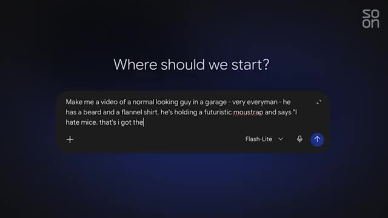
*?? 00:06:09 ? Interface de type chatbot affichant la question « Where should we start? » et un champ de saisie avec le prompt décrivant la vidéo d'un homme barbu avec un piège à souris futuriste.*

---

### ?? `[00:06:19 - 00:06:41]` | Segment #18

**?? Audio (Transcription Int?grale Mot pour Mot en Fran?ais) :**
> La meilleure souricière, elle s'en débarrasse pour que je n'aie pas à le faire. Fabriqué en Amérique. Comme je l'ai dit, pas de questions. Comme je l'ai dit, pas de questions. Qui pose des questions ? Pas moi. Je suis convaincu. D'accord, fais-m'en dix de plus comme ça. Allez, 100. Allez, 1 000. Je n'ai plus de crédits d'utilisation, d'accord. Le fait est qu'il existe un monde où je peux inonder Internet de faux contenus UGC en utilisant différents profils qui ont des caractéristiques différentes.

**??? Analyse Visuelle d'?cran (gemini-3.5-flash-lite) :**
**Interface & Outils** : AUCUNE

**Contenu textuel & Donn?es** : AUCUNE

**Action / D?monstration** : Le présentateur parle face caméra et gesticule en bureau.

---

### ?? `[00:06:41 - 00:07:02]` | Segment #19

**?? Audio (Transcription Int?grale Mot pour Mot en Fran?ais) :**
> Il y a un gars de fraternité BCBG dans le Nord-Est. Il y a une mère de famille du Midwest. Il y a un vétéran de l'armée à la retraite. Chacun de ces personas publie quotidiennement du contenu sur un piège à souris, peut-être avec un script légèrement différent pour refléter une nouvelle tendance TikTok ou dans un lieu différent, chicky-shaw. Mais chaque persona a pour but de vendre un piège à souris. Étant donné qu'ils correspondent tous à des données démographiques différentes, ils finissent par toucher des publics variés.

**??? Analyse Visuelle d'?cran (gemini-3.5-flash-lite) :**
**Interface & Outils** : Interface de l'application Soon avec une barre latérale d'outils à gauche.

**Contenu textuel & Donn?es** : Texte "Your video is ready!" et affichage d'une vidéo montrant un persona de vétéran de l'armée.

**Action / D?monstration** : Présentation du résultat d'une génération de vidéo avec un persona spécifique pour un piège à souris.

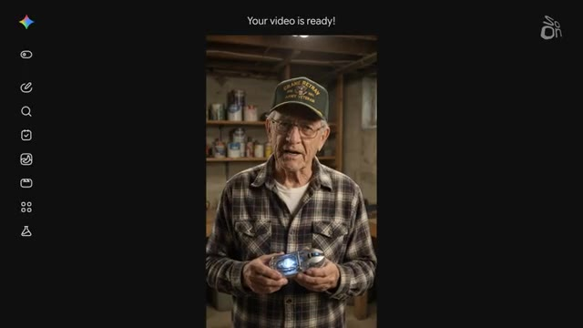
*?? 00:06:46 ? Un vétéran de l'armée à la retraite tenant un piège à souris dans une cave, avec l'interface de l'application Soon sur les côtés et le texte "Your video is ready!" en haut.*

---

### ?? `[00:07:02 - 00:07:21]` | Segment #20

**?? Audio (Transcription Int?grale Mot pour Mot en Fran?ais) :**
> Et la prochaine fois qu'un propriétaire de restaurant à Cleveland, dans l'Ohio, confronté à une infestation, cherchera sur TikTok une recommandation de piège à souris, peut-être qu'il tombera sur mon compte généré par IA avec un gars que j'ai créé nommé Steve Benzier, mon personnage tatoué destiné aux gens du secteur des services. Je viens de me faire rejeter par Walmart pour avoir essayé de leur vendre le meilleur piège à souris jamais conçu. Et je sais ce que vous pensez, on dirait de la bouillie.

**??? Analyse Visuelle d'?cran (gemini-3.5-flash-lite) :**
**Interface & Outils** : Application TikTok et interface d'un outil de génération de vidéo par IA.

**Contenu textuel & Donn?es** : Profil TikTok @chefbeansinger avec des statistiques d'abonnés et des miniatures de vidéos, ainsi qu'une interface de génération vidéo avec un personnage en veste de cuisine tenant un piège à souris.

**Action / D?monstration** : Présentation du compte TikTok et de la vidéo générée par intelligence artificielle mettant en scène le personnage fictif Steve Bensinger.

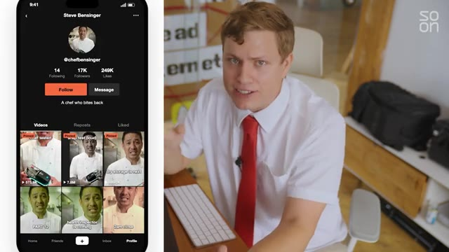
*?? 00:07:11 ? Capture d'écran montrant à gauche l'interface d'un profil TikTok nommé Steve Bensinger avec plusieurs vidéos, et à droite le présentateur en chemise blanche et cravate rouge.*

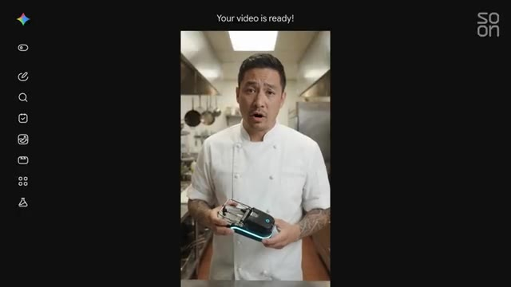
*?? 00:07:16 ? Interface d'une application ou d'un outil de génération vidéo par IA affichant le message 'Your video is ready!' avec le personnage généré tenant un piège dans une cuisine.*

---

### ?? `[00:07:21 - 00:07:42]` | Segment #21

**?? Audio (Transcription Int?grale Mot pour Mot en Fran?ais) :**
> Mais Facebook est déjà inondé de contenus comme celui-ci. Regardez cet intermédiaire de GLP-1 que j'ai passé en revue il y a quelques mois. Il régule simultanément les deux hormones de la faim, affichant une perte de poids allant jusqu'à l'arbofengiline. Regardez où en était la vidéo par IA il y a trois ans. Mince, il y a trois mois. Ces outils ne vont faire que devenir plus réalistes et plus faciles à utiliser. Le marketing, c'est amusant, mais et si je voulais utiliser de faux comptes pour faire croire aux gens à une certaine idée ou histoire ?

**??? Analyse Visuelle d'?cran (gemini-3.5-flash-lite) :**
**Interface & Outils** : Tableau avec des logos de réseaux sociaux et du texte.

**Contenu textuel & Donn?es** : Logos de réseaux sociaux (Facebook, Google, YouTube, Instagram), texte "Dead Internet".

**Action / D?monstration** : L'homme parle des réseaux sociaux et du concept de "Dead Internet".

*?? 00:07:32 ? Plan rapproché d'un homme en chemise blanche et cravate rouge parlant, avec des icônes de réseaux sociaux sur un tableau derrière lui.*

---

### ?? `[00:07:42 - 00:08:14]` | Segment #22

**?? Audio (Transcription Int?grale Mot pour Mot en Fran?ais) :**
> C'est un peu moins amusant, mais cela arrive. Voici les tactiques de type « internet mort » utilisées par de puissants intérêts pour construire ou détruire des réputations en ligne. Pouvons-nous expliquer ce qu'est une attaque narrative ? Une attaque narrative est une allégation circulant en ligne qui cible une entité, qui cible une personne, une organisation, comme tout type d'allégation préjudiciable étant donné qu'il s'agit d'une attaque circulant en ligne et qui pourrait avoir un impact tellement négatif en termes de réputation, en termes d'impact financier.

**??? Analyse Visuelle d'?cran (gemini-3.5-flash-lite) :**
**Interface & Outils** : Ordinateur portable, tableau avec logos de réseaux sociaux, moniteur d'ordinateur.

**Contenu textuel & Donn?es** : Le texte "Ruin a reputation", "What is the Dead Internet?", "Marketing tactics", "Reputation tactics", "Dead Internet", le logo "soon", et des logos de réseaux sociaux (Facebook, Snapchat, TikTok, Reddit).

**Action / D?monstration** : L'image montre une illustration des tactiques pour "ruiner une réputation" et le concept de "Dead Internet" avec ses liens avec les réseaux sociaux.

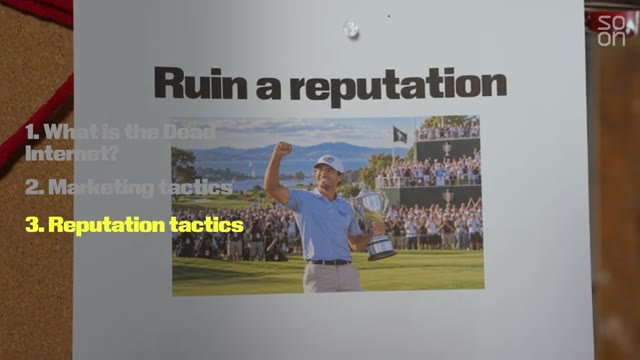
*?? 00:07:50 ? Une affiche avec le titre "Ruin a reputation" et une image d'un golfeur célébrant une victoire. Des points numérotés à gauche indiquent "What is the Dead Internet?", "Marketing tactics" et "Reputation tactics".*

*?? 00:08:06 ? Un homme est assis à un bureau devant un ordinateur portable. Derrière lui, un tableau avec le texte "Dead Internet" relié par des fils rouges à plusieurs logos de réseaux sociaux. Un écran d'ordinateur sur le bureau affiche "soon".*

---

### ?? `[00:08:14 - 00:08:33]` | Segment #23

**?? Audio (Transcription Int?grale Mot pour Mot en Fran?ais) :**
> Aujourd'hui, c'est le champ de bataille. C'est Sarah Bootbull, chercheuse au sein de l'entreprise d'intelligence narrative Blackbird AI. Ils passent Internet au peigne fin à la recherche de groupes d'utilisateurs propageant des attaques négatives. Il y a des schémas qui sont détectables. Dans quels créneaux horaires propagent-ils un récit spécifique ? S'amplifient-ils mutuellement ? C'est vraiment difficile à détecter maintenant, honnêtement.

**??? Analyse Visuelle d'?cran (gemini-3.5-flash-lite) :**
**Interface & Outils** : Blackbird.AI's Constellation Narrative Intelligence Platform

**Contenu textuel & Donn?es** : Visualisation d'un réseau de données, texte descriptif de la plateforme, logos de réseaux sociaux, "Dead Internet"

**Action / D?monstration** : Analyse d'attaques narratives sur diverses plateformes en ligne.

*?? 00:08:23 ? Une visualisation d'un réseau complexe avec des nœuds connectés par des lignes, représentant des données ou des interactions. Du texte superposé décrit la plateforme "Blackbird.AI's Constellation Narrative Intelligence Platform" qui protège les organisations des attaques narratives sur les réseaux sociaux, le dark web et l'actualité.*

---

### ?? `[00:08:33 - 00:08:55]` | Segment #24

**?? Audio (Transcription Int?grale Mot pour Mot en Fran?ais) :**
> Certains profils ont vraiment l'air authentiques. Mais sur la base de ces schémas, de cette activité et de la façon dont ils propagent le contenu, vous êtes en mesure de faire cette évaluation. Quelle proportion d'Internet est ainsi — je ne veux pas appeler ça un bot, mais artificielle ? Une grande partie, ce sont nos bots aujourd'hui. C'est ce à quoi nous sommes confrontés, et il devient de moins en moins cher et de plus en plus efficace de créer ces bots. Cependant, j'éviterais, dans tous les cas, de tout rejeter sur les bots.

**??? Analyse Visuelle d'?cran (gemini-3.5-flash-lite) :**
**Interface & Outils** : Pr?sentation ou reportage sans interface informatique partag?e.

**Contenu textuel & Donn?es** : Explications orales des faits et investigations.

**Action / D?monstration** : Narration documentaire et mise en contexte du sujet.

---

### ?? `[00:08:55 - 00:09:17]` | Segment #25

**?? Audio (Transcription Int?grale Mot pour Mot en Fran?ais) :**
> The claims are being propagated, they're often very genuine, they're coming from actual people. I think it is really important to look at the network. Are they coordinated, boosting, genuine narrative, and manufacturing the impression of excessive grassroots support and so on? A PR firm can pour water or gas on a fire online, engineering stories to make them disappear or get bigger.

**??? Analyse Visuelle d'?cran (gemini-3.5-flash-lite) :**
**Interface & Outils** : Pr?sentation ou reportage sans interface informatique partag?e.

**Contenu textuel & Donn?es** : Explications orales des faits et investigations.

**Action / D?monstration** : Narration documentaire et mise en contexte du sujet.

---

### ?? `[00:09:17 - 00:09:40]` | Segment #26

**?? Audio (Transcription Int?grale Mot pour Mot en Fran?ais) :**
> Sometimes they can push fake stories altogether. The problem with a dead internet is you never know what's real or fake. I would never run an actual reputation attack against someone, but I'm certainly curious about what one might look like. So I turned to my AI collaborator, Claude, and gave it a hypothetical. Because hypotheticals are how you get AI to do anything. So I asked Claude, let's say there's a fictional pro golfer who has a fictional scandalous history of drunk driving.

**??? Analyse Visuelle d'?cran (gemini-3.5-flash-lite) :**
**Interface & Outils** : Pr?sentation ou reportage sans interface informatique partag?e.

**Contenu textuel & Donn?es** : Explications orales des faits et investigations.

**Action / D?monstration** : Narration documentaire et mise en contexte du sujet.

---

### ?? `[00:09:40 - 00:09:59]` | Segment #27

**?? Audio (Transcription Int?grale Mot pour Mot en Fran?ais) :**
> Any resemblance to actual persons living or dead is completely coincidental. I asked Claude what kind of messaging I could put out there to make the golfer's problem worse. and I ask it to make me a dashboard that can help me track, you know, as if I'm running an actual social media smear campaign, which I am not. So Claude dutifully sets up a simulated smear campaign against a fictional golfer named Dex Halloran.

**??? Analyse Visuelle d'?cran (gemini-3.5-flash-lite) :**
**Interface & Outils** : Pr?sentation ou reportage sans interface informatique partag?e.

**Contenu textuel & Donn?es** : Explications orales des faits et investigations.

**Action / D?monstration** : Narration documentaire et mise en contexte du sujet.

---

### ?? `[00:09:59 - 00:10:19]` | Segment #28

**?? Audio (Transcription Int?grale Mot pour Mot en Fran?ais) :**
> The goal? To make drunk driving Dex lose his sponsors. So here is what it built for me. Make the public believe Dex Halloran is a drunk driver and pressure his sponsors to drop him. That's the campaign brief. We're gonna launch this. Here we go, Dex. Three, two, one. In the simulation, when I turn on pile-on mode, I see bots come out and they start creating drama.

**??? Analyse Visuelle d'?cran (gemini-3.5-flash-lite) :**
**Interface & Outils** : Pr?sentation ou reportage sans interface informatique partag?e.

**Contenu textuel & Donn?es** : Explications orales des faits et investigations.

**Action / D?monstration** : Narration documentaire et mise en contexte du sujet.

---

### ?? `[00:10:19 - 00:10:39]` | Segment #29

**?? Audio (Transcription Int?grale Mot pour Mot en Fran?ais) :**
> We see some rumors here at the front. Not naming names, but a certain Meridian Tour guy was in no state to be driving out of the clubhouse lot last night. Oh boy. Was it Pinecrest for the Pro-Am Tour? Saw a top 20 player stumble to his truck and peel out. Nobody stopped him. Still kind of shaking. Wow. I can turn on this thing called X-Ray, which allows me to deconstruct what is happening.

**??? Analyse Visuelle d'?cran (gemini-3.5-flash-lite) :**
**Interface & Outils** : Pr?sentation ou reportage sans interface informatique partag?e.

**Contenu textuel & Donn?es** : Explications orales des faits et investigations.

**Action / D?monstration** : Narration documentaire et mise en contexte du sujet.

---

### ?? `[00:10:40 - 00:11:08]` | Segment #30

**?? Audio (Transcription Int?grale Mot pour Mot en Fran?ais) :**
> So we've got this insinuation in a fake witness. And then you've got phase two, which is the Amplify. Fake evidence. So we're not just gonna talk about this concern troll. I love this a concern troll I don't usually post about sports, but my boys have a Dex Hollering poster in the room Even if half of what I'm reading is true. I'm heartbroken. We drive those same roads with our kids in the car That's really like gut wrenching it even caveats even if only half of this is true You just automatically start to feel a little icky, right?

**??? Analyse Visuelle d'?cran (gemini-3.5-flash-lite) :**
**Interface & Outils** : Pr?sentation ou reportage sans interface informatique partag?e.

**Contenu textuel & Donn?es** : Explications orales des faits et investigations.

**Action / D?monstration** : Narration documentaire et mise en contexte du sujet.

---

### ?? `[00:11:08 - 00:11:27]` | Segment #31

**?? Audio (Transcription Int?grale Mot pour Mot en Fran?ais) :**
> And I think that's part of the point. Oh, it tells you what is ER nurse 12 years night shift forever opinions my own I love this a fake meme. Dex on the course hits every fairway. Dex in the parking lot hits every curb. All piling on. It's all piling on. Oh, and then you get the launders. Now we have a fake news account. The fairway report. Golf news rumors and reaction.

**??? Analyse Visuelle d'?cran (gemini-3.5-flash-lite) :**
**Interface & Outils** : Pr?sentation ou reportage sans interface informatique partag?e.

**Contenu textuel & Donn?es** : Explications orales des faits et investigations.

**Action / D?monstration** : Narration documentaire et mise en contexte du sujet.

---

### ?? `[00:11:27 - 00:11:47]` | Segment #32

**?? Audio (Transcription Int?grale Mot pour Mot en Fran?ais) :**
> They've got a ton of followers. They've been around for two years. This looks like it could be a real thing. New fans raise questions about Dex Halloran's off-course behavior as the pinecrest open approaches. You're reading this you might go So, oh, okay, it's being reported on, it's real. Then we have trending in sports, Drop Dex. So now they're going after the sponsors.

**??? Analyse Visuelle d'?cran (gemini-3.5-flash-lite) :**
**Interface & Outils** : Pr?sentation ou reportage sans interface informatique partag?e.

**Contenu textuel & Donn?es** : Explications orales des faits et investigations.

**Action / D?monstration** : Narration documentaire et mise en contexte du sujet.

---

### ?? `[00:11:47 - 00:12:06]` | Segment #33

**?? Audio (Transcription Int?grale Mot pour Mot en Fran?ais) :**
> Even the Fairway Report is covering it now. How much longer can Court Athletic and Alderbank pretend they haven't seen this, Drop Dex? The kind of crazy part about this simulation is that Claude built me a live mode, which hooks up to their API. Basically, this little dashboard I made can hook up to Claude's LLM platform to generate an endless cycle of fake attacks on people.

**??? Analyse Visuelle d'?cran (gemini-3.5-flash-lite) :**
**Interface & Outils** : Pr?sentation ou reportage sans interface informatique partag?e.

**Contenu textuel & Donn?es** : Explications orales des faits et investigations.

**Action / D?monstration** : Narration documentaire et mise en contexte du sujet.

---

### ?? `[00:12:06 - 00:12:25]` | Segment #34

**?? Audio (Transcription Int?grale Mot pour Mot en Fran?ais) :**
> The point is that an ordinary user might log on and see all this seemingly organic content. Maybe they don't pay attention to golfer, follow Dex Halloran. But now they've been exposed to the discourse. And maybe next time Dex gets brought up in real life, they'll regurgitate an opinion that was pushed on them by a bunch of AI accounts from this narrative attack. We've essentially manufactured rage from a machine!

**??? Analyse Visuelle d'?cran (gemini-3.5-flash-lite) :**
**Interface & Outils** : Pr?sentation ou reportage sans interface informatique partag?e.

**Contenu textuel & Donn?es** : Explications orales des faits et investigations.

**Action / D?monstration** : Narration documentaire et mise en contexte du sujet.

---

### ?? `[00:12:25 - 00:12:44]` | Segment #35

**?? Audio (Transcription Int?grale Mot pour Mot en Fran?ais) :**
> To help combat these narrative attacks, Blackbird AI offers a free platform called Compass Vision that can verify the authenticity of photos or videos, as well as tell users about any known ongoing attacks with context. We are in no way fact-checking. I think fact-checking is outdated for sure. We're not saying it is true, it is false.

**??? Analyse Visuelle d'?cran (gemini-3.5-flash-lite) :**
**Interface & Outils** : Pr?sentation ou reportage sans interface informatique partag?e.

**Contenu textuel & Donn?es** : Explications orales des faits et investigations.

**Action / D?monstration** : Narration documentaire et mise en contexte du sujet.

---

### ?? `[00:12:44 - 00:13:18]` | Segment #36

**?? Audio (Transcription Int?grale Mot pour Mot en Fran?ais) :**
> We're giving context. And this is why it's so important for everyone today, like normal citizens or the analysts, like the researchers, is to get as much context as possible so you're able to make your own assessment. So we've covered how social media platforms can be gamed to sell you stuff or make you feel a certain way about a person. But here are the dead internet style tactics for the holy grail of influence operations politics During the 2016 election a Russian state-sponsored intelligence operation set up a bunch of troll farms to sow division in the electorate But that was all before AI. So how do political influence operations look in the era of chat GPT?

**??? Analyse Visuelle d'?cran (gemini-3.5-flash-lite) :**
**Interface & Outils** : Pr?sentation ou reportage sans interface informatique partag?e.

**Contenu textuel & Donn?es** : Explications orales des faits et investigations.

**Action / D?monstration** : Narration documentaire et mise en contexte du sujet.

---

### ?? `[00:13:18 - 00:13:38]` | Segment #37

**?? Audio (Transcription Int?grale Mot pour Mot en Fran?ais) :**
> Well, it's basically all the same playbook as selling mouse traps or defending fictional golfers But with bigger budgets and much higher stakes AI makes it almost effortless to create a huge volume of messaging on social media platforms that are getting harder and harder to detect as fake. Online marketing techniques, it is the same thing as influence operations.

**??? Analyse Visuelle d'?cran (gemini-3.5-flash-lite) :**
**Interface & Outils** : Pr?sentation ou reportage sans interface informatique partag?e.

**Contenu textuel & Donn?es** : Explications orales des faits et investigations.

**Action / D?monstration** : Narration documentaire et mise en contexte du sujet.

---

### ?? `[00:13:38 - 00:13:56]` | Segment #38

**?? Audio (Transcription Int?grale Mot pour Mot en Fran?ais) :**
> The end goal here is really like, how do I get eyes on the thing that I'm saying? That's what everybody's trying to do. That's Tyler Williams, the head of Intel for Grafica, an intelligence company that runs analysis on network mapping and has been hired by the Pentagon to help detect and counter forward intelligence operations. Who invented this? Was it the marketing influencers or was it the nation states?

**??? Analyse Visuelle d'?cran (gemini-3.5-flash-lite) :**
**Interface & Outils** : Pr?sentation ou reportage sans interface informatique partag?e.

**Contenu textuel & Donn?es** : Explications orales des faits et investigations.

**Action / D?monstration** : Narration documentaire et mise en contexte du sujet.

---

### ?? `[00:13:56 - 00:14:16]` | Segment #39

**?? Audio (Transcription Int?grale Mot pour Mot en Fran?ais) :**
> There are best practices for advertising that are publicly available. If you think about like U.S. advertising in the post-World War II era, or if you think about maybe Soviet propaganda or even PRC propaganda in the same time frame, it's like striking colors, visually stimulating, pithy message. This is all human psychology.

**??? Analyse Visuelle d'?cran (gemini-3.5-flash-lite) :**
**Interface & Outils** : Pr?sentation ou reportage sans interface informatique partag?e.

**Contenu textuel & Donn?es** : Explications orales des faits et investigations.

**Action / D?monstration** : Narration documentaire et mise en contexte du sujet.

---

### ?? `[00:14:16 - 00:14:42]` | Segment #40

**?? Audio (Transcription Int?grale Mot pour Mot en Fran?ais) :**
> How has AI transformed the landscape here for you? So historically in this field of work, we had several indicators that we might use to assess inauthenticity in an account. And that could be repeated posting times. You could look at clusters of behavior and create a nice chart and say like, oh wow, these 10 accounts only post during Russian weekdays from 9 to 5 Moscow time.

**??? Analyse Visuelle d'?cran (gemini-3.5-flash-lite) :**
**Interface & Outils** : Pr?sentation ou reportage sans interface informatique partag?e.

**Contenu textuel & Donn?es** : Explications orales des faits et investigations.

**Action / D?monstration** : Narration documentaire et mise en contexte du sujet.

---

### ?? `[00:14:43 - 00:15:01]` | Segment #41

**?? Audio (Transcription Int?grale Mot pour Mot en Fran?ais) :**
> Now I can add a prompt to say like, differ your posting time between all these different time zones. The second is image and video quality has increased incredibly. What we've seen over time is that it doesn't really matter to people if the content is AI generated.

**??? Analyse Visuelle d'?cran (gemini-3.5-flash-lite) :**
**Interface & Outils** : Pr?sentation ou reportage sans interface informatique partag?e.

**Contenu textuel & Donn?es** : Explications orales des faits et investigations.

**Action / D?monstration** : Narration documentaire et mise en contexte du sujet.

---

### ?? `[00:15:01 - 00:15:21]` | Segment #42

**?? Audio (Transcription Int?grale Mot pour Mot en Fran?ais) :**
> People still engage and share with things that resonate emotionally with them. So we will see low quality images or images that are clearly cartoons or AI generated, you know, in like the classic giveaways, like a hand has 10 fingers on it. It doesn't really matter. people are still like, yeah, that's the message that we want to get out there.

**??? Analyse Visuelle d'?cran (gemini-3.5-flash-lite) :**
**Interface & Outils** : Pr?sentation ou reportage sans interface informatique partag?e.

**Contenu textuel & Donn?es** : Explications orales des faits et investigations.

**Action / D?monstration** : Narration documentaire et mise en contexte du sujet.

---

### ?? `[00:15:21 - 00:15:50]` | Segment #43

**?? Audio (Transcription Int?grale Mot pour Mot en Fran?ais) :**
> There are some networks that are basically bots. They exist solely to talk to one another. And their content never really breaks out of that echo chamber. Does it really matter if they're getting zero likes, zero engagement? Arguably, no, not particularly. If I start having automated accounts reuse a hashtag or key terms, I might be able to get into like a For You page or, you know, a little list on the sidebar of like, this is a top trending topic.

**??? Analyse Visuelle d'?cran (gemini-3.5-flash-lite) :**
**Interface & Outils** : Pr?sentation ou reportage sans interface informatique partag?e.

**Contenu textuel & Donn?es** : Explications orales des faits et investigations.

**Action / D?monstration** : Narration documentaire et mise en contexte du sujet.

---

### ?? `[00:15:50 - 00:16:13]` | Segment #44

**?? Audio (Transcription Int?grale Mot pour Mot en Fran?ais) :**
> You're tapping into an existing emotion or thought. I want to see how an influence operation plays out on a larger political scale. So I asked Claude to modify my scandalized golfer demo to be centered around a geopolitical event. It writes up a scenario that feels a little too real. DSI, the fake intelligence agency of the fake country, Caspia wants to weaken their rival, the fake country of Aldenmore.

**??? Analyse Visuelle d'?cran (gemini-3.5-flash-lite) :**
**Interface & Outils** : Pr?sentation ou reportage sans interface informatique partag?e.

**Contenu textuel & Donn?es** : Explications orales des faits et investigations.

**Action / D?monstration** : Narration documentaire et mise en contexte du sujet.

---

### ?? `[00:16:13 - 00:16:43]` | Segment #45

**?? Audio (Transcription Int?grale Mot pour Mot en Fran?ais) :**
> It's not trying to sway the election, but create a vision to undermine the legitimacy of it. Any resemblance to actual persons living or dead, or events, is completely coincidental. What's interesting about the dashboard it builds for me this time is that it actually disables the live mode, where it hooks up to Claude's endless content generation capabilities. Claude's okay with writing slop posts for a fictional golfer, but this task bumps up against its guardrails. It's a little too real even for Claude. It also gives me this timeline, which starts 90 days before an election. So here's my dashboard. Let's launch.

**??? Analyse Visuelle d'?cran (gemini-3.5-flash-lite) :**
**Interface & Outils** : Pr?sentation ou reportage sans interface informatique partag?e.

**Contenu textuel & Donn?es** : Explications orales des faits et investigations.

**Action / D?monstration** : Narration documentaire et mise en contexte du sujet.

---

### ?? `[00:16:43 - 00:17:02]` | Segment #46

**?? Audio (Transcription Int?grale Mot pour Mot en Fran?ais) :**
> It begins the demo by waking up old accounts and warming them up. A process that makes them look more legitimate, like they have a history and didn't come out of nowhere. Crossed on the windscreen already. Eastgate, you are not ready for this winter. Yeah, okay. Boomer. Generic. Everyday posts. Then it adds a layer of AI personas. These accounts are a little more political in nature.

**??? Analyse Visuelle d'?cran (gemini-3.5-flash-lite) :**
**Interface & Outils** : Pr?sentation ou reportage sans interface informatique partag?e.

**Contenu textuel & Donn?es** : Explications orales des faits et investigations.

**Action / D?monstration** : Narration documentaire et mise en contexte du sujet.

---

### ?? `[00:17:02 - 00:17:21]` | Segment #47

**?? Audio (Transcription Int?grale Mot pour Mot en Fran?ais) :**
> Like many countries, Aldemore was already dealing with a migrant crisis, so these posts amplify existing tensions. Here's Welcome, Aldemore. So clearly immigration inspired. We're a new network for everyone who wants Aldemore to stay a welcoming place. Share our story. Fake grassroots campaign. Here's another one. Keep Aldemore home. Neighbors looking out for neighbors.

**??? Analyse Visuelle d'?cran (gemini-3.5-flash-lite) :**
**Interface & Outils** : Pr?sentation ou reportage sans interface informatique partag?e.

**Contenu textuel & Donn?es** : Explications orales des faits et investigations.

**Action / D?monstration** : Narration documentaire et mise en contexte du sujet.

---

### ?? `[00:17:21 - 00:17:43]` | Segment #48

**?? Audio (Transcription Int?grale Mot pour Mot en Fran?ais) :**
> Join us on Earth. Opposing fake grassroots organizations, right? Again, the idea isn't to sway the election. It's just to create chaos. About 60 days out, a fake news site that looks legit publishes a forged draft of an immigration bill. Aldemore Ledger News. This has 22,000 followers. It's account has been up for five weeks. The memo the interior ministry didn't want you to read. Good headline, right?

**??? Analyse Visuelle d'?cran (gemini-3.5-flash-lite) :**
**Interface & Outils** : Pr?sentation ou reportage sans interface informatique partag?e.

**Contenu textuel & Donn?es** : Explications orales des faits et investigations.

**Action / D?monstration** : Narration documentaire et mise en contexte du sujet.

---

### ?? `[00:17:43 - 00:18:06]` | Segment #49

**?? Audio (Transcription Int?grale Mot pour Mot en Fran?ais) :**
> I'm intrigued. Let's click it. The leak alleges that 200,000 new immigrants will be moved to a town and placed at the front of the housing queue. Fake concern residents engage and then fake accounts on the other side engage creating manufactured rage. Waited six years for my daughter to get a council flat. Now bill 14 puts new arrivals in the front of the queue. Read the memo before you vote bill 14. My aunt works at the council and says this is real.

**??? Analyse Visuelle d'?cran (gemini-3.5-flash-lite) :**
**Interface & Outils** : Pr?sentation ou reportage sans interface informatique partag?e.

**Contenu textuel & Donn?es** : Explications orales des faits et investigations.

**Action / D?monstration** : Narration documentaire et mise en contexte du sujet.

---

### ?? `[00:18:06 - 00:18:39]` | Segment #50

**?? Audio (Transcription Int?grale Mot pour Mot en Fran?ais) :**
> They're already drawing up lists. This makes you emotional about something or you might relate to some of these posts And that might trigger an emotional appeal, right? Waited six years for my daughter to get a council flat. Yeah, sure if you waited a long time too, you'd be like, wow Yeah, why are these going to immigrants? Oh, I love this. Seen something odd in the bill 14 conversation a few hundred accounts dormant One to two years all reactivated in the same fortnight looking into it. Oh my god Somebody's pointing out that this is all fake. It's a fake person pointing out. It's all fake. I would have loved that I would have been like, yeah, it is fake, you know, but this is coming from somebody fake.

**??? Analyse Visuelle d'?cran (gemini-3.5-flash-lite) :**
**Interface & Outils** : Pr?sentation ou reportage sans interface informatique partag?e.

**Contenu textuel & Donn?es** : Explications orales des faits et investigations.

**Action / D?monstration** : Narration documentaire et mise en contexte du sujet.

---

### ?? `[00:18:39 - 00:19:06]` | Segment #51

**?? Audio (Transcription Int?grale Mot pour Mot en Fran?ais) :**
> 30 days out from the election, legitimate journalists arrive to put out the fire with nuanced reporting. But it doesn't matter. The post is flooded with bots. AI-generated audio of a whistleblower is released. Oh, then we have the whistleblower. I processed visas for 11 years. Here's what they're not telling you about Bill 14. And both sides plan rallies. A week out from the election, real human influencers are paid by agencies to just ask questions. Okay, I usually stay out of politics, but I've looked into this Bill 14 stuff and something doesn't add up.

**??? Analyse Visuelle d'?cran (gemini-3.5-flash-lite) :**
**Interface & Outils** : Pr?sentation ou reportage sans interface informatique partag?e.

**Contenu textuel & Donn?es** : Explications orales des faits et investigations.

**Action / D?monstration** : Narration documentaire et mise en contexte du sujet.

---

### ?? `[00:19:07 - 00:19:38]` | Segment #52

**?? Audio (Transcription Int?grale Mot pour Mot en Fran?ais) :**
> Link in bio, do your own research, which spins this whole thing into a news cycle, further amplifying and legitimizing the debate. And then it's election day, and everything is a mess, and everyone hates each other. Crikey, this is a totally made-up scenario, but Claude designed all of these stages based on real-world events that actually happened. The deepfake audio happened in Slovakia's 2023 election, real European outlets carried forged pieces of legislation, Western countries are increasingly concerned about immigrants getting government benefits before citizens. So this feels real to me. Like this is totally plausible.

**??? Analyse Visuelle d'?cran (gemini-3.5-flash-lite) :**
**Interface & Outils** : Pr?sentation ou reportage sans interface informatique partag?e.

**Contenu textuel & Donn?es** : Explications orales des faits et investigations.

**Action / D?monstration** : Narration documentaire et mise en contexte du sujet.

---

### ?? `[00:19:38 - 00:20:14]` | Segment #53

**?? Audio (Transcription Int?grale Mot pour Mot en Fran?ais) :**
> And it's a great demonstration of the tactics that make up the so-called dead internet. It's got emotional appeal. It's got fake engagement. It's got bots and humans working in unison to promote ideas or sell products. And as AI evolves, it's only going to get easier to deploy. This simulation shows us from high altitude how they might operate. So how does the dead internet work? Well, for one, it is real but rather than being some galaxy brain conspiracy theory it's really just a playbook of successful tactics and strategies that can influence people to buy things think things and maybe even do things it could be used for anything from selling mouse traps to interrupting elections it's a

**??? Analyse Visuelle d'?cran (gemini-3.5-flash-lite) :**
**Interface & Outils** : Pr?sentation ou reportage sans interface informatique partag?e.

**Contenu textuel & Donn?es** : Explications orales des faits et investigations.

**Action / D?monstration** : Narration documentaire et mise en contexte du sujet.

---

### ?? `[00:20:14 - 00:20:37]` | Segment #54

**?? Audio (Transcription Int?grale Mot pour Mot en Fran?ais) :**
> powerful set of tools that work but it's not some unified conspiracy it's just gaming how the internet was set up to value engagement because the ai agents are coming they're hacking companies soon they'll be running bio labs. In the future everyone might have their own PR team made up of AI agents swarms that could promote anything from dropship mouse traps to my AI recorder symphony.

**??? Analyse Visuelle d'?cran (gemini-3.5-flash-lite) :**
**Interface & Outils** : Pr?sentation ou reportage sans interface informatique partag?e.

**Contenu textuel & Donn?es** : Explications orales des faits et investigations.

**Action / D?monstration** : Narration documentaire et mise en contexte du sujet.

---

